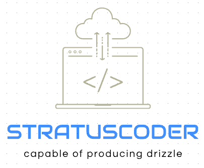

# dynatrace-api
Projects that use the Dynatrace API.  Just bring your tenant URL and your token and enjoy these projects.

<div id="top"></div>
<!--
*** Thanks for checking out the dynatrace-api. If you have a suggestion
*** that would make this better, please fork the repo and create a pull request
*** or simply open an issue with the tag "enhancement".
*** Don't forget to give the project a star!
*** Thanks again! Now go create something AMAZING! :D
-->


<!-- PROJECT SHIELDS -->
<!--
*** I'm using markdown "reference style" links for readability.
*** Reference links are enclosed in brackets [ ] instead of parentheses ( ).
*** See the bottom of this document for the declaration of the reference variables
*** for contributors-url, forks-url, etc. This is an optional, concise syntax you may use.
*** https://www.markdownguide.org/basic-syntax/#reference-style-links
-->
[![Contributors][contributors-shield]][contributors-url]
[![Forks][forks-shield]][forks-url]
[![Stargazers][stars-shield]][stars-url]
[![Issues][issues-shield]][issues-url]
[![MIT License][license-shield]][license-url]


<!-- PROJECT LOGO -->
<br />
<div align="center">
  <a href="https://github.com/stratuscoder/dynatrace-api">
    
  </a>

  <h3 align="center">dynatrace-api projects</h3>

  <p align="center">
    Dynatrace API Projects that work with the Dynatrace Managed and SaaS tenants!
    <br />
    <br />
    ·
    <a href="https://github.com/stratuscode/dynatrace-api/issues">If you find something that needs fixed, report it.</a>
    <br />
    ·
    <a href="https://github.com/stratuscode/dynatrace-api/issues">If you have a feature or project request, add it.</a>
  </p>
</div>


<!-- TABLE OF CONTENTS -->
<details>
  <summary>Table of Contents</summary>
  <ol>
    <li>
      <a href="#about-the-repo">About The Project</a>
      <ul>
        <li><a href="#built-with">Built With</a></li>
      </ul>
    </li>
    <li>
      <a href="#getting-started">Getting Started</a>
      <ul>
        <li><a href="#prerequisites">Prerequisites</a></li>
        <li><a href="#installation">Installation</a></li>
      </ul>
    </li>
    <li><a href="#usage">Usage</a></li>
    <li><a href="#roadmap">Roadmap</a></li>
    <li><a href="#contributing">Contributing</a></li>
    <li><a href="#license">License</a></li>
    <li><a href="#contact">Contact</a></li>
    <li><a href="#acknowledgments">Acknowledgments</a></li>
  </ol>
</details>


<!-- ABOUT THE REPO -->
## About The Repo

[![Dynatrace API][screenshot-dynatrace-api]](https://github.com/stratuscoder/dynatrace-api/)

This repo will contain many projects over time so check back regularly to see the progress of current and new projects.

Why are you doing this and sharing it publicly?

* I often find Dynatrace customers looking for unique solutions to using their data in more places than just in Dynatrace.  So I build projects that can be used by anyone.
* I love coding and extending the Dynatrace platform to other areas, that is why the Dynatrace API exists.
* All of this code is designed to be fairly abstract in nature, while it is coupled to the Dynatrace API, it is abstract in the fact that you only need to provide a tenant URL and Token.

Of course, according to my wife and kids I am not perfect, so if you find something that is not working please create an issue and I will work on it.  I hope you enjoy these projects and get ideas for more projects.

Thanks to all the people who will use these projects today, tomorrow, forever!

<p align="right">(<a href="#top">back to top</a>)</p>


### Built With

This section shows the major/minor frameworks/libraries used to bootstrap these projects. 

* [Next.js](https://nextjs.org/)
* [React.js](https://reactjs.org/)
* [Bootstrap](https://getbootstrap.com)
* [JQuery](https://jquery.com)

<p align="right">(<a href="#top">back to top</a>)</p>


## About The Projects

[![Dynatrace API - Network Inventory][screenshot-network-inventory]](https://github.com/stratuscoder/dynatrace-api/network-inventory)

This project uses the Smartscape topology V1 API to extract hosts and their connection relationships with other hosts and processes. It can be used to get data that includes host names, OS details, hosts communication in incoming and outgoing directions, processes running on each host, Dynatrace host unit consumption, network port usage and technologies found on each hosts. The data is shown as an HTML expandable table and this project has a built in option to export the data as and EXCEL spreadsheet or a PDF document.

If you find something that is not working please create an issue and I will work on it.  I hope you enjoy this projects and find it useful.

Thank you today, tomorrow, forever!

<p align="right">(<a href="#top">back to top</a>)</p>


<!-- GETTING STARTED -->
## Getting Started

Here you will find the instructions on setting up your project locally.
To get a local copy up and running follow these simple example steps.

### Prerequisites

This is an example of how to list things you need to use the software and how to install them.
* npm
  ```sh
  npm install npm@latest -g
  ```

### Installation

_Below is an example of how you can use the project on this repo once it is up and running. Check more specific details on the project readme.md_

1. Get to know the Dynatrace API tokens and authorization scopes at [Dynatrace API Tokens - Basics](https://www.dynatrace.com/support/help/shortlink/api-authentication)
2. Clone the repo
   ```sh
   git clone https://github.com/stratuscoder/dynatrace-api.git
   ```
3. Switch into the repo directory
   ```sh
   cd dynatrace-api
   ```
4. Install NPM packages
   ```sh
   npm install
   ```
5. Pick a project to run and cd into the project. (Example: network-inventory)
   ```sh
   cd network-inventory
   npm run server
   ```
6. Visit the running project in the browser using localhost and the port specified in the console.
   ```sh
   http://localhost:3333
   ```
7. Follow the project flow to configure the Dynatrace API Url and token and test the project.

<p align="right">(<a href="#top">back to top</a>)</p>


<!-- USAGE EXAMPLES -->
## Usage

This space will be used to show useful examples of how a project can be used. Additional screenshots, code examples and demos will fill up this space in the future.

_For more examples, please refer to the [Documentation](https://github.com/stratuscoder/dynatrace-api)_

<p align="right">(<a href="#top">back to top</a>)</p>


<!-- ROADMAP -->
## Roadmap

- [x] Add Changelog
- [x] Add back to top links
- [ ] Add Additional Projects w/ examples
- [ ] Add more content to documentation to help other easily use these projects
- [ ] Multi-language Support
    - [ ] Spanish

See the [open issues](https://github.com/stratuscoder/dynatrace-api/issues) for a full list of proposed features (and known issues).

<p align="right">(<a href="#top">back to top</a>)</p>


<!-- LICENSE -->
## License

Distributed under the MIT License. See `LICENSE.txt` for more information.

<p align="right">(<a href="#top">back to top</a>)</p>


<!-- CONTACT -->
## Contact

Your Name - [@your_twitter](https://twitter.com/your_username) - email@example.com

Project Link: [https://github.com/your_username/repo_name](https://github.com/your_username/repo_name)

<p align="right">(<a href="#top">back to top</a>)</p>

<!-- ACKNOWLEDGMENTS -->
## Acknowledgments

Use this space to list resources you find helpful and would like to give credit to. I've included a few of my favorites to kick things off!

* [Choose an Open Source License](https://choosealicense.com)
* [GitHub Pages](https://pages.github.com)
* [Font Awesome](https://fontawesome.com)
* [React Icons](https://react-icons.github.io/react-icons/search)

<p align="right">(<a href="#top">back to top</a>)</p>

<!-- MARKDOWN LINKS & IMAGES -->
<!-- https://www.markdownguide.org/basic-syntax/#reference-style-links -->
[contributors-shield]: https://img.shields.io/github/contributors/stratuscoder/dynatrace-api.svg?style=for-the-badge
[contributors-url]: https://github.com/stratuscoder/dynatrace-api/graphs/contributors
[forks-shield]: https://img.shields.io/github/forks/stratuscoder/dynatrace-api.svg?style=for-the-badge
[forks-url]: https://github.com/stratuscoder/dynatrace-api/network/members
[stars-shield]: https://img.shields.io/github/stars/stratuscoder/dynatrace-api.svg?style=for-the-badge
[stars-url]: https://github.com/stratuscoder/dynatrace-api/stargazers
[issues-shield]: https://img.shields.io/github/issues/stratuscoder/dynatrace-api.svg?style=for-the-badge
[issues-url]: https://github.com/stratuscoder/dynatrace-api/issues
[license-shield]: https://img.shields.io/github/license/stratuscoder/dynatrace-api.svg?style=for-the-badge
[license-url]: https://github.com/stratuscoder/dynatrace-api/blob/master/LICENSE.txt
[linkedin-shield]: https://img.shields.io/badge/-LinkedIn-black.svg?style=for-the-badge&logo=linkedin&colorB=555
[linkedin-url]: https://linkedin.com/in/stratuscoder
[screenshot-dynatrace-api]: documentation/images/screenshot-dynatrace-api.png
[screenshot-network-inventory]: documentation/images/screenshot-network-inventory.png